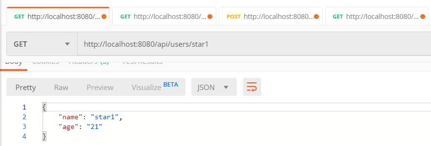
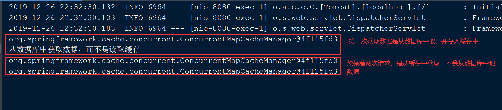

## Spring Boot 缓存技术

Spring 定义 CacheManager 和 Cache 接口用来统一不同的缓存技术。例如 JCache、 EhCache、 Hazelcast、 Guava、 Redis 等。在使用 Spring 集成 Cache 的时候，我们需要注册实现的 CacheManager 的 Bean。Spring Boot 默认使用的是 SimpleCacheConfiguration，即使用 ConcurrentMapCacheManager 来实现的缓存。

### CacheManager：缓存管理器，管理各种缓存组件

|CacheManager| 描述|
| --- | --- |
|SimpleCacheManager|使用检点 Collection 来存储缓存，主要用于测试|
|ConcurrentMapCacheManager| 使用 ConcurrentMap 存储缓存|
|NoOpCacheManager|仅用于测试，不会实际存储缓存|
|EhCacheCacheManager|使用 EhCache 作为缓存技术|
|GuavaCacheManager|使用 Guava 作为缓存技术|
|HazelcastCacheManager|使用 Hazelcast 作为缓存技术|
|JCacheCacheManager| 支持 JCache（JSR-107）标准的实现作为缓存技术|
|RedisCacheManager|使用 Redis 作为缓存技术|

### Cache 注解详解

- **@CacheConfig**：主要用于配置该类中会用到的一些共用的缓存配置。  
在这里 @CacheConfig(cacheNames = "users")：配置了该数据访问对象中返回的内容将存储于名为 users 的缓存对象中，我们也可以不使用该注解，直接通过 @Cacheable 自己配置缓存集的名字来定义。

- **@Cacheable**：主要针对方法配置，能够根据方法的请求参数对其结果进行缓存。同时在查询时，会先从缓存中获取，若不存在才再发起对数据库的访问。该注解主要有下面几个参数：

  - *value、cacheNames*：两个等同的参数（cacheNames 为Spring 4 新增，作为 value 的别名），用于指定缓存存储的集合名。由于 Spring 4 中新增了 @CacheConfig，因此在 Spring 3 中原本必须有的 value 属性，也成为非必需项了。

  - *key*：缓存对象存储在 Map 集合中的 key 值，非必需，缺省按照函数的所有参数组合作为 key 值，若自己配置需使用 SpEL表 达式，比如：@Cacheable(key = "#p0")：使用函数第一个参数作为缓存的 key 值，更多关于 SpEL 表达式的详细内容可参考官方文档。

  - *condition*：缓存对象的条件，非必需，也需使用SpEL表达式，只有满足表达式条件的内容才会被缓存，比如：@Cacheable(key = "#p0", condition = "#p0.length() < 3")，表示只有当第一个参数的长度小于3的时候才会被缓存，若做此配置上面的AAA用户就不会被缓存，读者可自行实验尝试。

  - *unless*：另外一个缓存条件参数，非必需，需使用 SpEL 表达式。它不同于 condition 参数的地方在于它的判断时机，该条件是在函数被调用之后才做判断的，所以它可以通过对 result 进行判断。

  - *keyGenerator*：用于指定 key 生成器，非必需。若需要指定一个自定义的 key 生成器，我们需要去实现`org.springframework.cache.interceptor.KeyGenerator` 接口，并使用该参数来指定。需要注意的是，该参数与 key 是互斥的。

  - *cacheManager*：用于指定使用哪个缓存管理器，非必需。只有当有多个时才需要使用。

  - *cacheResolver*：用于指定使用那个缓存解析器，非必需。需通过
`org.springframework.cache.interceptor.CacheResolver` 接口来实现自己的缓存解析器，并用该参数指定。


- **@CachePut**：配置于方法上，能够根据参数定义条件来进行缓存，它与 @Cacheable 不同的是，它不会去检查缓存中是否存在之前执行过的结果，而是每次都会执行该方法，并将执行结果以键值对的形式存入缓存中，所以主要用于数据新增和修改操作上。它的参数与 @Cacheable 类似，具体功能可参考上面对 @Cacheable 参数的解析。

- **@CacheEvict**：配置于函数上，通常用在删除方法上，用来从缓存中移除相应数据。除了同 @Cacheable 一样的参数之外，它还有下面两个参数：

  - *allEntries*：非必需，默认为 false。当为 true 时，会移除所有数据。

  - *beforeInvocation*：非必需，默认为 false，会在调用方法之后移除数据；当为 true 时，会在调用方法之前移除数据。

### 搭建 Spring Boot 默认缓存 

**开启缓存支持**
 
在启动类上添加 `@EnableCaching` 开启缓存支持，进行自动扫描。

```java
@SpringBootApplication
@EnableCaching  // 开启缓存功能
public class CacheApplication {

	public static void main(String[] args) {
		SpringApplication.run(CacheApplication.class, args);
	}
}
```

**添加 spring-boot-starter-cache 依赖**

在 pom.xml 中添加 spring-boot-starter-cache 依赖。

```xml
<dependency>
    <groupId>org.springframework.boot</groupId>
    <artifactId>spring-boot-starter-cache</artifactId>
</dependency>
```

### 准备数据 

模拟数据库数据

```java
/**
 * 数据工厂，模拟数据库的数据
 *
 * @author star
 **/
public class DataFactory {

    private DataFactory() {
    }

    private static List<UserDto> userDtoList;

    static {
        // 初始化集合
        userDtoList = new ArrayList<>();

        UserDto user = null;
        for (int i = 0; i < 10; i++) {
            user = new UserDto();
            user.setName("star" + i);
            user.setAge("2" + i);
            userDtoList.add(user);
        }
    }

    public static List<UserDto> getUserDaoList() {
        return userDtoList;
    }
}

```

### 编写业务代码

- 编写 DAO 层

```java
/**
 * UserRepository
 *
 * @author star
 **/
@Repository
public class UserRepository {

    /**
     * 获取用户信息(此处是模拟的数据)
     */
    public UserDto getUser(String username) {
        UserDto user = getUserFromList(username);
        return user;
    }

    /**
     * 删除用户信息
     */
    public List<UserDto> deleteUser(String username) {

        List<UserDto> userDaoList = DataFactory.getUserDaoList();
        userDaoList.remove(getUserFromList(username));

        return userDaoList;
    }

    /**
     * 新增数据
     */
    public List<UserDto> save(String username) {
        // 添加到集合
        List<UserDto> userDaoList = DataFactory.getUserDaoList();
        for (UserDto userDto : userDaoList) {
            // 不能重复添加相同数据
            if (Objects.equals(userDto.getName(), username)) {
                return userDaoList;
            }
        }
        UserDto user = new UserDto();
        user.setName(username);
        user.setAge("50");
        userDaoList.add(user);

        return userDaoList;
    }

    /**
     * 从模拟的数据集合中筛选 username 的数据
     */
    private UserDto getUserFromList(String username) {

        List<UserDto> userDaoList = DataFactory.getUserDaoList();
        for (UserDto user : userDaoList) {
            if (Objects.equals(user.getName(), username)) {
                return user;
            }
        }
        return null;
    }
}
```

- 编写 Service 层

```java
/**
 * UserService
 *
 * @author star
 **/
@Service
@CacheConfig(cacheNames = "users")// 指定缓存名称，在本类中是全局的
public class UserService {

    @Autowired
    private UserRepository userRepository;

    /**
     * 缓存 key 是 username 的数据到缓存 users 中，
     * 如果没有指定 key，则方法参数作为 key 保存到缓存中
     */
    @Cacheable(key = "#username")
    public UserDto getUser(String username) {
        System.out.println("从数据库中获取数据，而不是读取缓存");
        return userRepository.getUser(username);
    }


    /**
     * 新增或更新缓存中的数据
     */
    @CachePut(key = "#username")
    public List<UserDto> save(String username) {
        return userRepository.save(username);
    }

    /**
     * 从缓存 users 中删除 key 是 username 的数据
     */
    @CacheEvict(key = "#username")
    public List<UserDto> deleteUser(String username) {
        System.out.println("从数据库中删除数据，以及缓存中的数据");
        return userRepository.deleteUser(username);
    }
}
```

- 编写 Controller 层

```java
/**
 * CacheResource
 *
 * @author star
 **/
@RestController
@RequestMapping("/api")
public class CacheResource {

    @Autowired
    private UserService userService;

    @GetMapping("/users/{username}")
    public ResponseEntity<UserDto> getUser(@PathVariable String username) {
        // 获取数据
        UserDto user = userService.getUser(username);
        return ResponseEntity.ok(user);
    }

    @PutMapping("/users/{username}")
    public ResponseEntity<List<UserDto>> save(@PathVariable String username) {
        List<UserDto> userDtoList = userService.save(username);

        return ResponseEntity.ok(userDtoList);
    }

    @DeleteMapping("/users/{username}")
    public ResponseEntity<List<UserDto>> delete(@PathVariable String username) {
        List<UserDto> userDtoList = userService.deleteUser(username);

        return ResponseEntity.ok(userDtoList);
    }
}
```

### 演示
  
通过多次向接口 `http://localhost:8080/api/users/star1` GET 数据来观察效果：



可以看到缓存的启用和效果如下所示：




