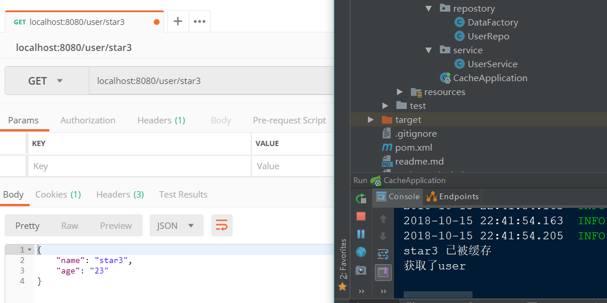

# Springboot的缓存技术
### CacheManager ：缓存管理器，管理各种缓存组件。
|CacheManager| 描述|
| --- | --- |
|SimpleCacheManager|使用检点Collection来存储缓存，主要用于测试|
|ConcurrentMapCacheManager| 使用ConcurrentMap来存储缓存|
|NoOpCacheManager|仅用于测试，不会实际存储缓存|
|EhCacheCacheManager|使用EhCache作为缓存技术|
|GuavaCacheManager|使用Guava作为缓存技术|
|HazelcastCacheManager|使用Hazelcast作为缓存技术|
|JCacheCacheManager| 支持JCache（JSR-107）标准的实现作为缓存技术|
|RedisCacheManager|使用Redis作为缓存技术|

### Cache注解详解
- **@CacheConfig**：主要用于配置该类中会用到的一些共用的缓存配置。  
在这里@CacheConfig(cacheNames = "users")：配置了该数据访问对象中返回的内容将存储于名为users的缓存对象中，我们也可以不使用该注解，直接通过@Cacheable自己配置缓存集的名字来定义。

- **@Cacheable**：主要针对方法配置，能够根据方法的请求参数对其结果进行缓存。同时在查询时，会先从缓存中获取，若不存在才再发起对数据库的访问。该注解主要有下面几个参数：

  - *value、cacheNames*：两个等同的参数（cacheNames为Spring 4新增，作为value的别名），用于指定缓存存储的集合名。由于Spring 4中新增了@CacheConfig，因此在Spring 3中原本必须有的value属性，也成为非必需项了。
  - *key*：缓存对象存储在Map集合中的key值，非必需，缺省按照函数的所有参数组合作为key值，若自己配置需使用SpEL表达式，比如：@Cacheable(key = "#p0")：使用函数第一个参数作为缓存的key值，更多关于SpEL表达式的详细内容可参考官方文档
  - *condition*：缓存对象的条件，非必需，也需使用SpEL表达式，只有满足表达式条件的内容才会被缓存，比如：@Cacheable(key = "#p0", condition = "#p0.length() < 3")，表示只有当第一个参数的长度小于3的时候才会被缓存，若做此配置上面的AAA用户就不会被缓存，读者可自行实验尝试。
  - *unless*：另外一个缓存条件参数，非必需，需使用SpEL表达式。它不同于condition参数的地方在于它的判断时机，该条件是在函数被调用之后才做判断的，所以它可以通过对result进行判断。
  - *keyGenerator*：用于指定key生成器，非必需。若需要指定一个自定义的key生成器，我们需要去实现org.springframework.cache.interceptor.KeyGenerator接口，并使用该参数来指定。需要注意的是：该参数与key是互斥的
  - *cacheManager*：用于指定使用哪个缓存管理器，非必需。只有当有多个时才需要使用
  - *cacheResolver*：用于指定使用那个缓存解析器，非必需。需通过org.springframework.cache.interceptor.CacheResolver接口来实现自己的缓存解析器，并用该参数指定。
##### 除了这里用到的两个注解之外，还有下面几个核心注解：

- **@CachePut**：配置于函数上，能够根据参数定义条件来进行缓存，它与@Cacheable不同的是，它每次都会真是调用函数，所以主要用于数据新增和修改操作上。它的参数与@Cacheable类似，具体功能可参考上面对@Cacheable参数的解析
- **@CacheEvict**：配置于函数上，通常用在删除方法上，用来从缓存中移除相应数据。除了同@Cacheable一样的参数之外，它还有下面两个参数：
  - *allEntries*：非必需，默认为false。当为true时，会移除所有数据
  - *beforeInvocation*：非必需，默认为false，会在调用方法之后移除数据。当为true时，会在调用方法之前移除数据。

### 案列
- 在pom.xml文件添加cache依赖
```java
<dependency>
    <groupId>org.springframework.boot</groupId>
    <artifactId>spring-boot-starter-cache</artifactId>
</dependency>
```
- 添加缓存配置
```java
/**
 * 持久层
 *
 * @author kevin
 * @date 2018-10-14 21:26
 **/
@Repository
@CacheConfig(cacheNames = "users")// 指定缓存名称，在本类中是全局的
public class UserRepo {

    /**
     * 获取用户信息(此处是模拟的数据)
     *
     * @param username
     * @return
     */
    @Cacheable(key = "#username") // 缓存key是username的数据到缓存users中，如果没有指定key则方法参数作为key保存到缓存中
    public UserDto getUser(String username) {

        UserDto user = getUserFromList(username);
        System.out.println(username + " 已被缓存");
        return user;
    }

    /**
     * 删除用户信息
     *
     * @param username
     * @return
     */
    @CacheEvict(key = "#username") // 从缓存users中删除key是username的数据
    public List<UserDto> deleteUser(String username) {

        List<UserDto> userDaoList = DataFactory.getUserDaoList();
        userDaoList.remove(getUserFromList(username));

        return userDaoList;
    }

    /**
     *
     * @param username
     * @return
     */
    @CachePut(key = "#username") // 新增或更新缓存中的数据
    public List<UserDto> save(String username) {

        // 添加到集合
        List<UserDto> userDaoList = DataFactory.getUserDaoList();
        for (UserDto userDto : userDaoList) {
             // 不能重复添加相同数据
             if(Objects.equals(userDto.getName(),username)){
                 return userDaoList;
             }
        }
        UserDto user = new UserDto();
        user.setName(username);
        user.setAge("50");
        userDaoList.add(user);

        return userDaoList;
    }

    /**
     * 从模拟的数据集合中筛选username的数据
     *
     * @param username
     * @return
     */
    private UserDto getUserFromList(String username) {

        List<UserDto> userDaoList = DataFactory.getUserDaoList();
        for (UserDto user : userDaoList) {
            if (Objects.equals(user.getName(), username)) {
                return user;
            }
        }
        return null;
    }
}
```
- 在控制器中调用
```java
/**
 * 控制器
 *
 * @author kevin
 * @date 2018-10-14 21:00
 **/
@RestController
@RequestMapping("/user")
public class DemoController {

    @Autowired
    private UserService userService;

    @GetMapping("/{username}")
    public ResponseEntity<UserDto> getUser(@PathVariable String username){

        // 获取数据
        UserDto user = userService.getUser(username);

        return ResponseEntity.ok(user);
    }

    @PutMapping("/{username}")
    public ResponseEntity<List<UserDto>> save(@PathVariable String username){
        List<UserDto> userDtoList = userService.save(username);

        return ResponseEntity.ok(userDtoList);
    }

    @DeleteMapping("/{username}")
    public ResponseEntity<List<UserDto>> delete(@PathVariable String username){
        List<UserDto> userDtoList = userService.deleteUser(username);

        return ResponseEntity.ok(userDtoList);
    }
}
```
- 效果
第一次请求`/user/star3`时，方法被调用的同时也将数据存入了缓存，在控制台打印了“star3已被缓存”。


第二次请求`/user/star3`时，就直接从缓存里拿取数据，只在控制台输出了“获取了user”。


