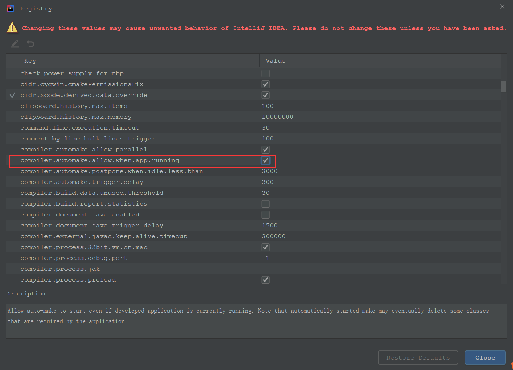

## Spring Boot 使用 devtools 实现热部署

### 概述

在进行 Spring Boot 的 Web 项目开发中，我们经常会遇到源代码文件、配置文件等的修改，但每次修改后都会重启 Web 服务器才能修改后的文件生效，这样很耗时，影响开发效率。而热部署就是不需要重启 Web 服务器就可以保证各项文件修改后便立即生效。

### spring-boot-devtools 介绍

- `spring-boot-devtools` 是一个为开发者服务的模块，可以实现 Spring Boot 热部署，其中最重要的功能就是自动将应用代码更改到最新的 App 上面去。

- `spring-boot-devtools` 可以实现页面热部署，实现类文件热部署（类文件修改后不会立即生效），实现对属性配置文件的热部署。其原理是 `spring-boot-devtools` 会监听 Classpath 下的文件变动，并且会立即重启应用（发生在保存时机）。

- 由于采用的虚拟机机制，重启的时候只是加载了在开发的 Class，没有重新加载第三方的 JAR 包，所以重启是很快的。

### 配置热部署

- 在 pom.xml 文件中，添加项目 `spring-boot-devtools` 依赖

```xml
<!--热部署依赖-->
<dependency>
    <groupId>org.springframework.boot</groupId>
    <artifactId>spring-boot-devtools</artifactId>
    <optional>true</optional>
 </dependency>

<plugin>
    <groupId>org.springframework.boot</groupId>
    <artifactId>spring-boot-maven-plugin</artifactId>
    <!--没有该项配置，热部署不会起作用-->
    <configuration>
        <fork>true</fork>
    </configuration>
 </plugin>
```
- 在资源文件 `application.properties` 中进行热部署的相关配置

```properties
# 页面修改后立即生效，关闭缓存，立即刷新
spring.thymeleaf.cache=false
# 热部署生效
spring.devtools.restart.enabled=true
# 设置需要重启的目录
spring.devtools.restart.additional-paths=src/java/main
# 设置不需要重启的目录
spring.devtools.restart.exclude=static/**,public/**,WEB-INF/**
# 为 mybatis 设置，生产环境可删除
# restart.include.mapper=/mapper-[\\w-\\.]+jar
# restart.include.pagehelper=/pagehelper-[\\w-\\.]+jar
```
当热部署搭建完成后，程序只要启动一次即可，后面修改代码时，只需保存后便可以触发热部署机制，自动重启服务。

### 设置 IDEA 环境自动编译 

在使用 IDEA 编译器时，需要设置自动编译。

- 在编译器选项中勾选 `Build project automatically` 选项


- 使用快捷键：`Ctrl + Alt + Shift + /` 调出 Registry 窗口,勾选 `compiler.automake.allow.when.app.running` 选项

