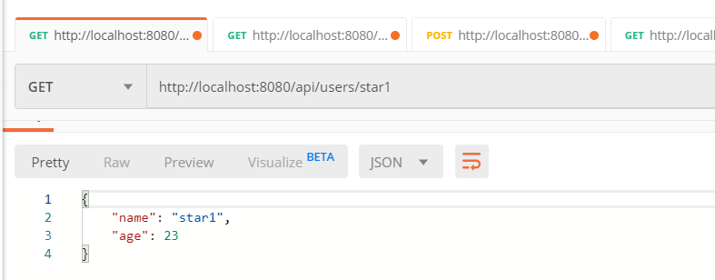
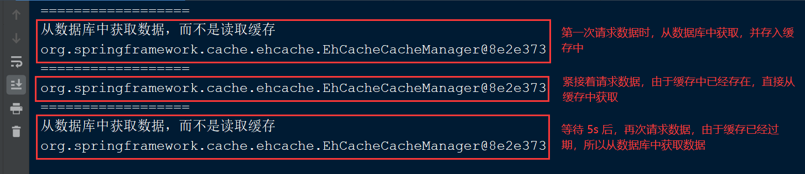

## Spring Boot 集成 Ehcache 实现缓存机制

Ehcache 是一个用 Java 实现的使用简单，高速，实现线程安全的缓存管理类库，Ehcache 提供了用内存，磁盘文件存储，以及分布式存储方式等多种灵活的 cache 管理方案，采用限制比较宽松的 Apache License V2.0 作为授权方式。Ehcache 从 Hibernate 发展而来，逐渐覆盖了 Cache 界的所有功能，是当前成长趋向不错的一个项目。它具有快速、简单易用、低消耗、强扩展性、依赖性低、支持缓存或元素的失效、支持对象或序列化缓存、支持内存缓存和磁盘缓存、提供了 FIFO、LRU、LFU 缓存策略、采用分布式缓存机制等特点。

### 添加依赖

在 pom.xml 文件中加入 `spring-boot-starter-cache` 和  `ehcache` 依赖包。

```xml
<!--spring 的缓存依赖，使用 spring 缓存机制必须加入的依赖-->
<dependency>
    <groupId>org.springframework.boot</groupId>
    <artifactId>spring-boot-starter-cache</artifactId>
</dependency>

<!--集成 ehcache 需要的依赖-->
<dependency>
    <groupId>net.sf.ehcache</groupId>
    <artifactId>ehcache</artifactId>
</dependency>
```

### 创建 Ehcache 配置文件

在资源文件(resource)目录下创建 `ehcache.xml` 配置文件，进行 Ehcache 的配置。

```xml
<?xml version="1.0" encoding="UTF-8"?>

<ehcache>
    <!--默认的 ehcache 缓存配置-->
    <defaultCache
            eternal="false"
            maxElementsInMemory="1000"
            overflowToDisk="false"
            diskPersistent="false"
            timeToIdleSeconds="0"
            timeToLiveSeconds="600"
            memoryStoreEvictionPolicy="LRU" />

    <!--指定缓存空间名称-->
    <cache name="user"
           maxElementsInMemory="1000"
           eternal="false"
           overflowToDisk="false"
           diskPersistent="false"
           timeToLiveSeconds="5" // 设置缓存有效时间为 5 秒
           memoryStoreEvictionPolicy="LRU"
    />
</ehcache>
```
### 配置 application.properties 文件

在 application.properties 文件中，配置 ehcache.xml 文件的加载路径。

```properties
# ehcache 缓存配置
spring.cache.ehcache.config=classpath:config/ehcache.xml
```

### Ehcache 配置文件参数说明

name：缓存名称。  

maxElementsInMemory：缓存最大数目  

maxElementsOnDisk：硬盘最大缓存个数。   

eternal：对象是否永久有效，一旦设置了，timeout 将不起作用。  

overflowToDisk：是否保存到磁盘，当系统宕机时，会存入本地磁盘。 

timeToIdleSeconds：设置对象在失效前的允许闲置时间（单位：秒）。仅当 eternal=false 对象不是永久有效时使用，可选属性，默认值是 0，也就是可闲置时间无穷大。  

timeToLiveSeconds：设置对象在失效前允许存活时间（单位：秒）。
最大时间介于创建时间和失效时间之间。仅当 eternal=false 对象不是永久有效时使用，默认是 0，也就是对象存活时间无穷大。  

diskPersistent：是否缓存虚拟机重启期数据。  

diskSpoolBufferSizeMB：这个参数设置 DiskStore（磁盘缓存）的缓存区大小。默认是 30MB。每个 Cache 都应该有自己的一个缓冲区。

diskExpiryThreadIntervalSeconds：磁盘失效线程运行时间间隔，默认是 120 秒。  

memoryStoreEvictionPolicy：当达到 maxElementsInMemory 限制时，Ehcache 将会根据指定的策略去清理内存。默认策略是 LRU（最近最少使用）。你可以设置为 FIFO（先进先出）或是 LFU（较少使用）。  

clearOnFlush：内存数量最大时是否清除。

memoryStoreEvictionPolicy：缓存策略，可选策略有:   

- FIFO(First In First Out)，这个是大家最熟的，先进先出。 

- LFU(Less Frequently Used)，就是上面例子中使用的策略，直白一点就是讲一直以来最少被使用的。如上面所讲，缓存的元素有一个hit属性，hit值最小的将会被清出缓存。  

- LRU(Least Recently Used)，最近最少使用的，缓存的元素有一个时间戳，当缓存容量满了，而又需要腾出地方来缓存新的元素的时候，那么现有缓存元素中时间戳离当前时间最远的元素将被清出缓存。 

### 开启缓存支持
 
在 SpringBoot 应用主类上添加 `@EnableCaching` 开启缓存支持，进行自动扫描。

```java
@SpringBootApplication
@EnableCaching
public class EhcacheApplication {

    public static void main(String[] args) {
        SpringApplication.run(EhcacheApplication.class, args);
    }
}
```

### 准备数据

模拟数据库数据

```java
/**
 * 数据工厂，模拟数据库的数据
 *
 * @author star
 **/
public class DataFactory {

    private DataFactory() {
    }

    private static List<UserDTO> userDtoList;

    static {
        // 初始化集合
        userDtoList = new ArrayList<>();

        UserDTO user = null;
        for (int i = 0; i < 5; i++) {
            user = new UserDTO();
            user.setName("star" + i);
            user.setAge(23);
            userDtoList.add(user);
        }
    }

    public static List<UserDTO> getUserDaoList() {
        return userDtoList;
    }
}
```

### 编写业务代码

- 编写 DAO 层

```java

/**
 * UserRepository
 *
 * @author star
 */
@Repository
public class UserRepository {

    /**
     * 获取用户信息(此处是模拟的数据)
     */
    public UserDTO getUserByName(String username) {
        UserDTO user = getUserFromList(username);
        return user;
    }

    /**
     * 从模拟的数据集合中筛选 username 的数据
     */
    private UserDTO getUserFromList(String username) {

        List<UserDTO> userDaoList = DataFactory.getUserDaoList();
        for (UserDTO user : userDaoList) {
            if (Objects.equals(user.getName(), username)) {
                return user;
            }
        }
        return null;
    }
}
```

- 编写 Service 层

```java
/**
 * UserService
 *
 * @author star
 **/
@Service
@CacheConfig(cacheNames = "user")
public class UserService {

    @Autowired
    private UserRepository userRepository;

    @Cacheable(key = "#name")
    public UserDTO getUser(String name) {
        UserDTO user = userRepository.getUserByName(name);

        return user;
    }
}
```

由于在上一篇 [springboot-cache](../springboot-cache) 已经对缓存用法做了详细说明，这里就简单介绍一下：

- `@Cacheable`: 主要针对方法配置，能够根据方法的请求参数对其结果进行缓存。同时在查询时，会先从缓存中获取，若不存在才再发起对数据库的访问。

- `@CachePut`：配置于方法上时，能够根据参数定义条件来进行缓存，其与 @Cacheable 不同的是，它不会去检查缓存中是否存在之前执行过的结果，而是每次都会执行该方法，并将执行结果以键值对的形式存入指定的缓存中，所以主要用于数据新增和修改操作上。

- `@CacheEvict`：配置于方法上时，表示从缓存中移除相应数据。

- 编写 Controller 层

```java
/**
 * UserResource
 *
 * @author star
 */
@RestController
@RequestMapping("/api")
public class UserResource {

    @Autowired
    private UserService userService;

    @GetMapping("/users/{name}")
    public ResponseEntity<UserDTO> getUser(@PathVariable("name") String name) {
        UserDTO user = userService.getUser(name);

        return ResponseEntity.ok(user);
    }
}
```

## 演示

通过多次向接口 `http://localhost:8080/api/users/star1` GET 数据来观察效果：



可以看到缓存的启用和效果如下所示：  




