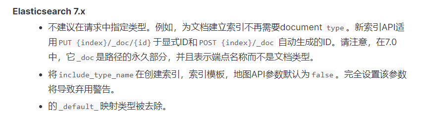
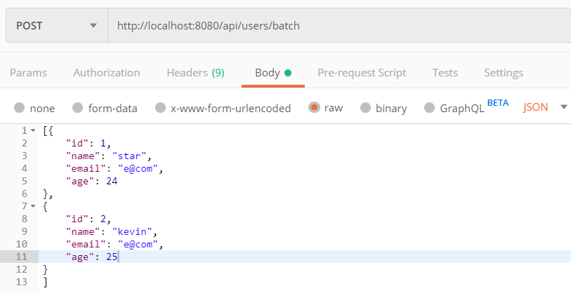
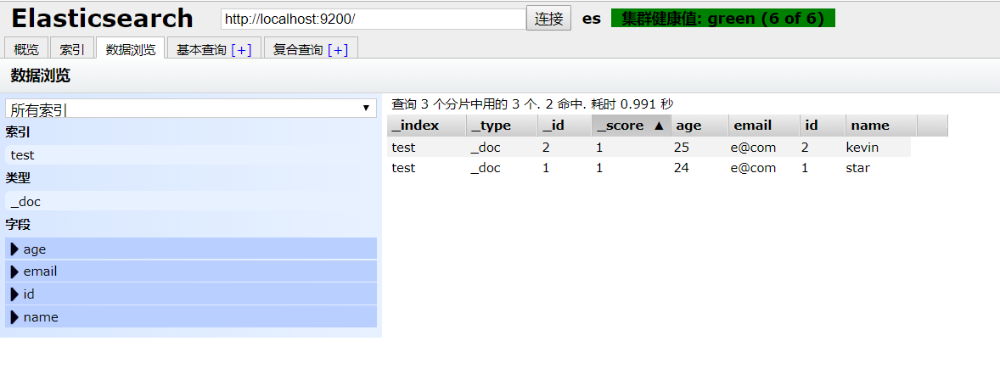
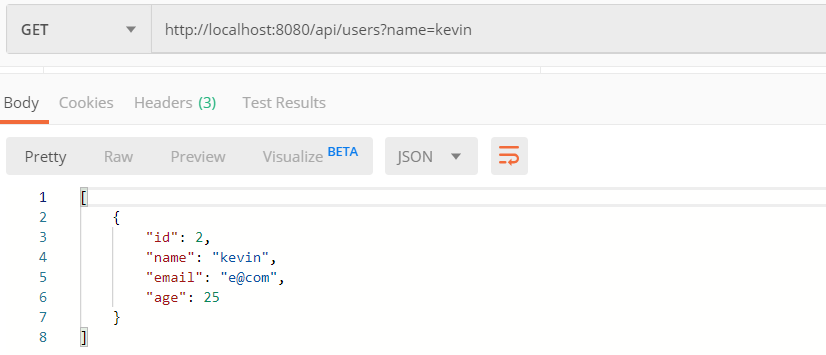

## Spring Boot 集成 ElasticSearch （7.x 版本）搜索引擎

ElasticSearch 是一个基于 Lucene 的搜索服务器。它提供了一个分布式多用户能力的全文搜索引擎，基于 RESTful web 接口。Elasticsearch 是用 Java 语言开发的，并作为 Apache 许可条款下的开放源码发布，是一种流行的企业级搜索引擎。ElasticSearch 用于云计算中，能够达到实时搜索、稳定、可靠、快速、安装使用方便。官方客户端在 Java、.NET、PHP、Python、Apache Groovy、Ruby 和许多其他语言中都是可用的。  

本文主要讲述了 Spring Boot 如何集成 ElasticSearch 搜索引擎，并使用 ElasticSearch 官方提供的 [Java High Level REST Client](https://www.elastic.co/guide/en/elasticsearch/client/java-rest/7.5/java-rest-high.html) 进行 Java 客户端操作。

### 环境准备

- ElasticSearch 7.5.1
- Spring Boot 2.1.9

首先需要安装 ElasticSearch 环境，并且最好安装一个 ElasticSearch 可视化界面（这里推荐 ElasticSearch Head 插件）便于我们查看数据。  

ElasticSearch 和 ElasticSearch Head 安装可以参考本人写的这篇博客：[Widows 环境下安装 ElasticSearch 并配置 ElasticSearch Head 插件](https://blog.csdn.net/oschina_41790905/article/details/104166069)

### 添加依赖

在 pom.xml 文件中，添加  ElasticSearch 提供的 `Java High Level REST Client` 相关依赖。  

**注意**：在添加 ElasticSearch 相关依赖时，一定要指明版本号。如果不指定版本号，会直接继承 Spring Boot 的版本号，这样会导致与 ElasticSearch 的版本不一致，而出现错误。

```xml
<!-- ElasticSearch High Level Client -->
<dependency>
    <groupId>org.elasticsearch.client</groupId>
    <artifactId>elasticsearch-rest-high-level-client</artifactId>
    <version>7.5.1</version>
</dependency>

<dependency>
    <groupId>org.elasticsearch</groupId>
    <artifactId>elasticsearch</artifactId>
    <version>7.5.1</version>
</dependency>

<dependency>
    <groupId>org.elasticsearch.client</groupId>
    <artifactId>elasticsearch-rest-client</artifactId>
    <version>7.5.1</version>
</dependency>
<!-- ./ ElasticSearch High Level Client -->
```
### 配置 RestHighLevelClient  

这里进行 RestHighLevelClient 配置，用于操作 ElasticSearch。

```java
/**
 * EsRestHighLevelClient
 *
 * @author star
 */
@Configuration
public class EsRestHighLevelClientConfig {

    @Value("${spring.elasticsearch.rest.scheme}")
    private String scheme;

    @Value("${spring.elasticsearch.rest.ip-address}")
    private List<String> ipAddressList;

    @Bean
    public RestHighLevelClient restHighLevelClient() {
        return new RestHighLevelClient(RestClient.builder(this.createHttpHost()));
    }

    /**
     * 创建 HttpHost 对象
     *
     * @return 返回 HttpHost 对象数组
     */
    private HttpHost[] createHttpHost() {
        Asserts.check(!CollectionUtils.isEmpty(ipAddressList), "ElasticSearch cluster ip address cannot empty");

        HttpHost[] httpHosts = new HttpHost[ipAddressList.size()];
        for (int i = 0, len = ipAddressList.size(); i < len; i++) {
            String ipAddress = ipAddressList.get(i);
            String[] values = ipAddress.split(":");

            String ip = values[0];
            int port = Integer.parseInt(values[1]);
            // 创建 HttpHost
            httpHosts[i] = new HttpHost(ip, port, scheme);
        }

        return httpHosts;

    }
}
```

### 编写 ElaticSearch 相关 API

- 索引创建

ElaticSearch 7.x 的版本中已经废弃了 mapping，弃用了 type，也就是一个 index 相当于一个表。  

详情见官方文档关于[映射类型](https://www.elastic.co/guide/en/elasticsearch/reference/current/removal-of-types.html)去除部分。以下是关于 ElaticSearch 7.x 的映射类型描述：



```java
/**
  * 创建 ES 索引
  *
  * @param index      索引
  * @param properties 文档属性集合
  * @return 返回 true，表示创建成功
  * @throws IOException
  */
public boolean createIndex(String index, Map<String, Map<String, Object>> properties) throws IOException {
    XContentBuilder builder = XContentFactory.jsonBuilder();
    // ES 7.0 后的版本中，已经弃用 type
    builder.startObject()
            .startObject("mappings")
            .field("properties", properties)
            .endObject()
            .startObject("settings")
            .field("number_of_shards", DEFAUT_SHARDS)
            .field("number_of_replicas", DEFAUT_REPLICAS)
            .endObject()
            .endObject();

    CreateIndexRequest request = new CreateIndexRequest(index).source(builder);
    CreateIndexResponse response = restHighLevelClient.indices().create(request, RequestOptions.DEFAULT);

    return response.isAcknowledged();
}
```

- 判断索引是否存在

```java
/**
 * 判断索引是否存在
 *
 * @param index 索引
 * @return 返回 true，表示存在
 */ 
public boolean isExistIndex(String index) throws IOException {
    GetIndexRequest getIndexRequest = new GetIndexRequest(index);
    getIndexRequest.local(false);
    getIndexRequest.humanReadable(true);
    getIndexRequest.includeDefaults(false);

    return restHighLevelClient.indices().exists(getIndexRequest, RequestOptions.DEFAULT);
}
```

- 删除索引

```java
/**
 * 删除索引
 *
 * @param index 索引
 * @return 返回 true，表示删除成功
 */
public boolean deleteIndex(String index) throws IOException {
    try {
        DeleteIndexRequest request = new DeleteIndexRequest(index);
        AcknowledgedResponse response = restHighLevelClient.indices().delete(request, RequestOptions.DEFAULT);

        return response.isAcknowledged();
    } catch (ElasticsearchException exception) {
        if (exception.status() == RestStatus.NOT_FOUND) {
            throw new NotFoundException("Not found index: " + index);
        }

        throw exception;
    }
}
```

- 保存文档

```java
/**
 * 保存文档
 * <p>
 * 如果文档存在，则更新文档；如果文档不存在，则保存文档。
 *
 * @param document 文档数据
 */
public void save(String index, ElasticSearchDocument<?> document) throws IOException {
    IndexRequest indexRequest = new IndexRequest(index);
    indexRequest.id(document.getId());
    indexRequest.source(JSON.toJSONString(document.getData()), XContentType.JSON);
    // 保存文档数据
    restHighLevelClient.index(indexRequest, RequestOptions.DEFAULT);

}

/**
 * 批量保存文档
 * <p>
 * 如果集合中有些文档已经存在，则更新文档；不存在，则保存文档。
 *
 * @param index        索引
 * @param documentList 文档集合
 */
public void saveAll(String index, List<ElasticSearchDocument<?>> documentList) throws IOException {
    if (CollectionUtils.isEmpty(documentList)) {
        return;
    }
    // 批量请求
    BulkRequest bulkRequest = new BulkRequest();
    documentList.forEach(doc -> {
        bulkRequest.add(new IndexRequest(index)
                .id(doc.getId())
                .source(JSON.toJSONString(doc.getData()), XContentType.JSON));
    });

    restHighLevelClient.bulk(bulkRequest, RequestOptions.DEFAULT);

}
```
- 删除文档

```java
/**
 * 根据文档 ID 删除文档
 *
 * @param index 索引
 * @param id    文档 ID
 */
public void delete(String index, String id) throws IOException {
    DeleteRequest deleteRequest = new DeleteRequest(index, id);

    restHighLevelClient.delete(deleteRequest, RequestOptions.DEFAULT);
}

/**
 * 根据查询条件删除文档
 *
 * @param index        索引
 * @param queryBuilder 查询条件构建器
 */
public void deleteByQuery(String index, QueryBuilder queryBuilder) throws IOException {
    DeleteByQueryRequest deleteRequest = new DeleteByQueryRequest(index).setQuery(queryBuilder);
    deleteRequest.setConflicts("proceed");

    restHighLevelClient.deleteByQuery(deleteRequest, RequestOptions.DEFAULT);

}

/**
 * 根据文档 ID 批量删除文档
 *
 * @param index  索引
 * @param idList 文档 ID 集合
 */
public void deleteAll(String index, List<String> idList) throws IOException {
    if (CollectionUtils.isEmpty(idList)) {
        return;
    }
    BulkRequest bulkRequest = new BulkRequest();
    idList.forEach(id -> bulkRequest.add(new DeleteRequest(index, id)));

    restHighLevelClient.bulk(bulkRequest, RequestOptions.DEFAULT);
}
```

- 获取文档

```java
/**
 * 根据索引和文档 ID 获取数据
 *
 * @param index 索引
 * @param id    文档 ID
 * @param <T>   数据类型
 * @return T
 */
public <T> T get(String index, String id, Class<T> resultType) throws IOException {
    GetRequest getRequest = new GetRequest(index, id);
    GetResponse response = restHighLevelClient.get(getRequest, RequestOptions.DEFAULT);
    String resultAsString = response.getSourceAsString();

    return JSON.parseObject(resultAsString, resultType);
}

/**
 * 条件查询
 *
 * @param index         索引
 * @param sourceBuilder 条件查询构建起
 * @param <T>           数据类型
 * @return T 类型的集合
 */
public <T> List<T> searchByQuery(String index, SearchSourceBuilder sourceBuilder, Class<T> resultType) throws IOException {
    // 构建查询请求
    SearchRequest searchRequest = new SearchRequest(index).source(sourceBuilder);
    // 获取返回值
    SearchResponse response = restHighLevelClient.search(searchRequest, RequestOptions.DEFAULT);
    SearchHit[] hits = response.getHits().getHits();
    // 创建空的查询结果集合
    List<T> results = new ArrayList<>(hits.length);
    for (SearchHit hit : hits) {
        // 以字符串的形式获取数据源
        String sourceAsString = hit.getSourceAsString();
        results.add(JSON.parseObject(sourceAsString, resultType));
    }

    return results;

}
```

### 演示

- 使用 Postman 调用接口 POST `http://localhost:8080/api/users/batch` 向 ElasticSearch 中插入 2 条测试数据：



- 使用可视化插件 ElasticSearch Head 查看数据：



- 根据 ID 获取数据：


- 根据 name 获取数据：




### 参考

ElasticSearch Java Rest Client：https://www.elastic.co/guide/en/elasticsearch/client/java-rest/7.5/java-rest-high.html

ElasticSearch Reference：https://www.elastic.co/guide/en/elasticsearch/reference/current/index.html

Spring Boot 实战之 NoSQL 整合(ElasticSearch 7.3 版本)：https://cloud.tencent.com/developer/article/1522132


