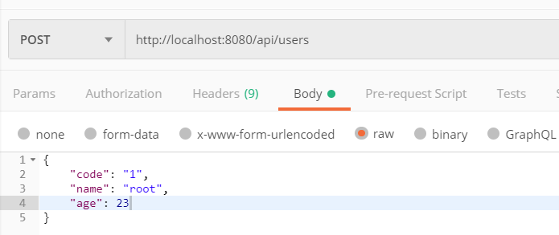
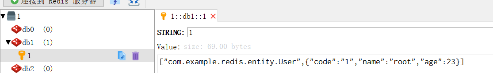

## Spring Boot 集成 Redis 实现缓存机制

简单来说， Redis 就是一个数据库，不过与传统数据库不同的是 Redis 的数据是存在内存中的，所以读写速度非常快，因此 Redis 被广泛应用于缓存方向。另外，Redis 也经常用来做分布式锁。Redis 提供了多种数据类型来支持不同的业务场景。除此之外，Redis 支持事务 、持久化、LUA 脚本、LRU 驱动事件、多种集群方案。

### 添加依赖

在 pom.xml 文件，添加 Redis 项目依赖

```java
<!-- Redis -->
<dependency>
    <groupId>org.springframework.boot</groupId>
    <artifactId>spring-boot-starter-data-redis</artifactId>
</dependency>
```

### 添加 Redis 数据源配置

在资源文件 `application.properties` 中对 Redis 进行配置
```java
# Redis 数据库索引（默认为0）
spring.redis.database=1
# Redis 服务器地址（默认本地，可以根据需要修改）
spring.redis.host=127.0.0.1
# Redis 服务器连接端口
spring.redis.port=6379
# Redis 服务器连接密码（默认为空）
spring.redis.password=
# 连接池最大连接数（使用负值表示没有限制）
spring.redis.pool.max-active=1000
# 连接池最大阻塞等待时间（使用负值表示没有限制）
spring.redis.pool.max-wait=-1
# 连接池中的最大空闲连接
spring.redis.pool.max-idle=10
# 连接池中的最小空闲连接
spring.redis.pool.min-idle=2
# 连接超时时间（毫秒）
spring.redis.timeout=0
```

### 创建 Redis 配置类


- 在 pom.xml 文件中添加 `jackson-databind` 依赖

添加此依赖，是用于设置数据存入 Redis 缓存的序列化方式为 Json 格式。

```java
<dependency>
    <groupId>com.fasterxml.jackson.core</groupId>
    <artifactId>jackson-databind</artifactId>
    <version>2.9.5</version>
</dependency>
```
- 设置 RedisTemplate 

```java
/**
 * Redis 缓存配置
 *
 * @author star
 */
@Configuration
@EnableCaching
public class RedisConfig {

    /**
     * redisTemplate 序列化使用的 jdkSerializeable,
     * 存储二进制字节码, 所以自定义序列化类
     */
    @Bean
    public RedisTemplate<String, Object> redisTemplate(RedisConnectionFactory redisConnectionFactory) {
        RedisTemplate<String, Object> redisTemplate = new RedisTemplate<>();
        redisTemplate.setConnectionFactory(redisConnectionFactory);

        // 使用 Jackson2JsonRedisSerialize 替换默认序列化
        Jackson2JsonRedisSerializer jackson2JsonRedisSerializer = new Jackson2JsonRedisSerializer(Object.class);

        ObjectMapper objectMapper = new ObjectMapper();
         objectMapper.enable(DeserializationFeature.USE_LONG_FOR_INTS);
        //objectMapper.setVisibility(PropertyAccessor.ALL, JsonAutoDetect.Visibility.ANY);
        objectMapper.activateDefaultTyping(objectMapper.getPolymorphicTypeValidator(), ObjectMapper.DefaultTyping.NON_FINAL);
        jackson2JsonRedisSerializer.setObjectMapper(objectMapper);

        StringRedisSerializer stringRedisSerializer = new StringRedisSerializer();
        // key 采用 String 的序列化方式
        redisTemplate.setKeySerializer(stringRedisSerializer);
        // hash 的 key 采用 String 的序列化方式
        redisTemplate.setHashKeySerializer(stringRedisSerializer);
        // value 采用 Jackson 的序列化方式
        redisTemplate.setValueSerializer(jackson2JsonRedisSerializer);
        // hash 的 value 采用 Jackson 的序列化方式
        redisTemplate.setHashValueSerializer(jackson2JsonRedisSerializer);
        // 开启事务
        redisTemplate.setEnableTransactionSupport(true);
        redisTemplate.afterPropertiesSet();
        return redisTemplate;
    }
}
```
- RedisTemplate 和 StringRedisTemplate 区别
1. StringRedisTemplate 是 RedisTemplate 的一个直接子类。
2. RedisTemplate 是一个泛型类，StringRedisTemplate 则不是。
3. StringRedisTemplate 默认采用是 String 的序列化策略；
RedisTemplate 默认采用是 JDK 的序列化策略。
4. 当 Redis 存入的数据是字符串数据时，使用 StringRedisTemplate 即可；
当 Redis 中的数据是复杂的对象类型，存取时不做任何转换，使用RedisTemplate 最合适。

- RedisTemplate 的相关方法

```java
redisTemplate.opsForValue(); // 操作字符串
redisTemplate.opsForHash(); // 操作 hash
redisTemplate.opsForList(); // 操作 list
redisTemplate.opsForSet(); // 操作 set（无序）
redisTemplate.opsForZSet(); // 操作有序的 set
```

### 编写业务代码

- 编写 Redis 缓存相关操作 API

```java
/**
 * Redis 操作 API
 *
 * @author star
 */
@Service
public class RedisTemplateAPI {

    @Autowired
    private RedisTemplate<String, Object> redisTemplate;

    /**
     * 获取指定 key 的缓存过期时间，单位：秒
     *
     * @param key 键，不能为 null
     * @return 返回给定 key 的剩余生存时间，返回 0 代表永久有效
     */
    public long getExpire(String key) {

        return redisTemplate.getExpire(key);
    }

    /**
     * 设置缓存过期时间，单位秒
     *
     * @param key     键
     * @param timeout 过期时间，单位：秒
     */
    public void expire(String key, long timeout) {
        if (timeout > 0) {
            redisTemplate.expire(key, timeout, TimeUnit.SECONDS);
        }
    }

    /**
     * 对 key 进行自增
     *
     * @param key   键
     * @param delta 自增的数量
     * @return 返回当前数
     */
    public long increment(String key, long delta) {
        return redisTemplate.opsForValue().increment(key, delta);
    }

    /**
     * 判断 key 是否存在
     *
     * @param key 键
     * @return true 表示存在，false 表示不存在
     */
    public boolean hasKey(String key) {
        return redisTemplate.hasKey(key);
    }

    /**
     * 查找所有符合给定模式 pattern 的 key
     */
    public Set<String> keys(String pattern) {
        return redisTemplate.keys(pattern);
    }

    /**
     * 删除指定 key 的缓存
     *
     * @param key 键
     */
    public void delete(String key) {
        redisTemplate.delete(key);
    }

    /**
     * 存入缓存（将字值 value 关联到 key）
     *
     * @param key   键
     * @param value 缓存值
     */
    public void setValue(String key, Object value) {
        redisTemplate.opsForValue().set(key, value);
    }

    /**
     * 存入缓存值并设置过期时间（秒）
     *
     * @param key     键
     * @param value   缓存值
     * @param timeout 过期时间（以秒为单位）
     */
    public void setValue(String key, Object value, long timeout) {
        redisTemplate.opsForValue().set(key, value, timeout, TimeUnit.SECONDS);
    }

    /**
     * 根据 key 获取缓存值
     *
     * @param key 键
     */
    public Object getValue(String key) {
        return redisTemplate.opsForValue().get(key);
    }

    /**
     * 存入值到哈希表缓存中
     *
     * @param key   键
     * @param value 值
     */
    public void hashSet(String key, Map<String, Object> value, long timeout) {
        // 保存值
        redisTemplate.opsForHash().putAll(key, value);
        // 设置过期时间
        this.expire(key, timeout);

    }

    /**
     * 将哈希表 key 中的域 field 的值设为 value
     *
     * @param key   键
     * @param field 域，一般指对象字段名称
     * @param value 值
     */
    public void hashSet(String key, String field, Object value) {
        redisTemplate.opsForHash().put(key, field, value);
    }

    /**
     * 返回哈希表 key 中给定域 field 的值
     *
     * @param key   键
     * @param field 域，一般指对象字段名称
     * @return
     */
    public Object hashGet(String key, String field) {
        return redisTemplate.opsForHash().get(key, field);
    }

    /**
     * 删除哈希表 key 中的一个或多个指定域，不存在的域将被忽略
     *
     * @param key
     * @param fields
     */
    public void hashDelete(String key, Object... fields) {
        redisTemplate.opsForHash().delete(key, fields);
    }

    /**
     * 返回哈希表 key 中，所有的域和值
     *
     * @param key 键
     * @return 返回 hashKey 对应的所有键值
     */
    public Map<Object, Object> hashGetAll(String key) {
        return redisTemplate.opsForHash().entries(key);
    }

    /**
     * 将一个值 value 插入到列表 key 的表头
     *
     * @param key   键
     * @param value 缓存值
     * @return 返回列表的长度
     */
    public long leftPush(String key, String value) {
        ListOperations<String, Object> operations = redisTemplate.opsForList();
        Long length = operations.leftPush(key, value);

        return length;
    }

    /**
     * 移除并返回列表 key 的头元素。
     *
     * @param key
     * @return 返回列表 key 的头元素。
     */
    public Object leftPop(String key) {
        ListOperations<String, Object> operations = redisTemplate.opsForList();

        return operations.leftPop(key);
    }

    /**
     * 将一个值 value 插入到列表 key 的表尾(最右边)。
     *
     * @param key
     * @param value
     * @return 返回列表的长度。
     */
    public long rightPush(String key, String value) {
        ListOperations<String, Object> operations = redisTemplate.opsForList();
        Long length = operations.rightPush(key, value);

        return length;
    }

}
```

- 编写 Service 层

```java
/**
 * UserService
 *
 * @author star
 */
@Service
public class UserService {

    @Autowired
    private RedisTemplateAPI redisTemplateAPI;

    public void save(User user) {
        redisTemplateAPI.setValue(user.getCode(), user, 10000);
    }

    public User get(String code) {
        User user = (User)redisTemplateAPI.getValue(code);

        return user;
    }

}
```

- 编写 Controller 层

```java
/**
 * UserResource
 *
 * @author star
 */
@RestController
@RequestMapping("/api")
public class UserResource {

    @Autowired
    private UserService userService;

    @PostMapping("/users")
    public ResponseEntity<Void> saveUser(@RequestBody User user) {
        userService.save(user);

        return ResponseEntity.ok().build();
    }

    @GetMapping("/users/{code}")
    public ResponseEntity<User> getUser(@PathVariable String code) {
        User user = userService.get(code);

        return ResponseEntity.ok(user);
    }

}
```

### 演示

通过接口 `http://localhost:8080/api/users` 向 Redis 数据库插入数据:  




查看 Redis 数据库中的数据:




